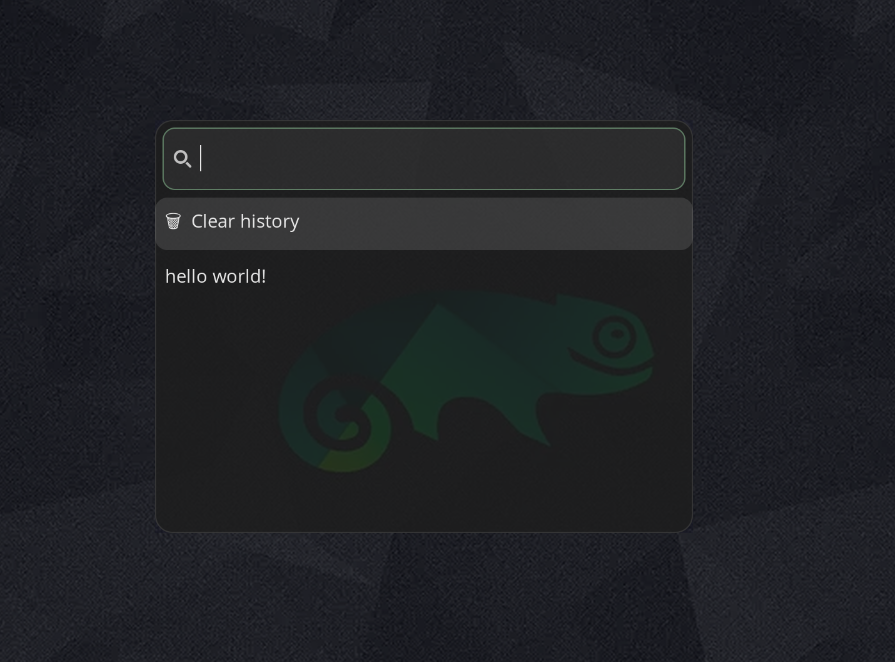

# wayland-clipboard-menu

A lightweight clipboard manager for Wayland using wl-clipboard, cliphist and wofi.

So, the Wayland session is required, do not use on X11.

## Screenshot



## Features

- Lightweight Wayland clipboard manager
- Persistent history using cliphist
- Wofi popup menu
- Automatic trimming to last 200 entries
- Clear-all option

## Requirements

- Wayland session
- wl-clipboard
- cliphist
- wofi

## Installation

First, install the required packages on Debian-based Wayland systems:
```
sudo apt install wl-clipboard cliphist wofi 
```

Now you need to create the automatic startup script:
```
mkdir ~/.config/autostart
vi ~/.config/autostart/cliphist.desktop
```

Then paste the lines in "cliphist.desktop":
```
[Desktop Entry]
Type=Application
Name=Cliphist Watcher
Exec=/bin/bash -lc '$HOME/.local/bin/cliphist-trim.sh & exec wl-paste --watch cliphist store'
X-GNOME-Autostart-enabled=true
```

Now, create two shell scripts and add execute permissions:
```
mkdir ~/.local/bin
touch ~/.local/bin/cliphist-trim.sh
touch ~/.local/bin/clipboard-menu.sh
chmod +x ~/.local/bin/cliphist-trim.sh
chmod +x ~/.local/bin/clipboard-menu.sh
```

Paste the lines below into "~/.local/bin/cliphist-trim.sh":
```
#!/bin/bash
cliphist list | tail -n +201 | cut -f1 | cliphist delete 2>/dev/null
```

And paste the lines into "~/.local/bin/clipboard-menu.sh" to activate the clipboard functionality:
```
#!/bin/bash

SELECTION=$(
  {
    echo "🗑  Clear history"
    cliphist list | awk -F '\t' 'NF>1 {print $2}' | tac
  } | wofi --dmenu --prompt "Clipboard" --width 500 --height 400
)

if [[ "$SELECTION" == "🗑"* ]]; then
  cliphist wipe
  pkill -x wl-paste 2>/dev/null
  rm -rf "$HOME/.cache/cliphist"
  wl-copy --clear
  wl-paste --watch cliphist store &
  exit 0
fi

printf "%s" "$SELECTION" | wl-copy
```

## Appearance

To customize wofi, you can create a default style file in "~/.config/wofi/style.css" and paste these lines (for the dark theme):
```
window {
  margin: 0;
  padding: 6px;
  border-radius: 14px;
  background-color: rgba(30, 30, 30, 0.85);
  backdrop-filter: blur(18px);
  border: 1px solid rgba(255, 255, 255, 0.10);
  box-shadow:
    0 20px 60px rgba(0, 0, 0, 0.55),
    0 8px 24px rgba(0, 0, 0, 0.35),
    0 0 20px rgba(120, 120, 255, 0.15);
}
#input {
  margin: 6px;
  padding: 8px;
  border-radius: 10px;
  border: none;
  background-color: rgba(255, 255, 255, 0.06);
}
#entry {
  padding: 8px;
  border-radius: 10px;
}
#entry:selected {
  background-color: rgba(255, 255, 255, 0.12);
}
```

## Configuration

Go to Keyboard Settings to add a new shortcut. You can configure it for each of the following:
 - Name: Clipboard
 - Command: ~/.local/bin/clipboard-menu.sh
 - Key combinations: Ctrl+Shift+v

Finally, follow the Logout and Login procedure to reload it.

After logging in, use the key combination "Ctrl+Shift+v" to see your "Clipboard List" in the pop-up.

Enjoy!

